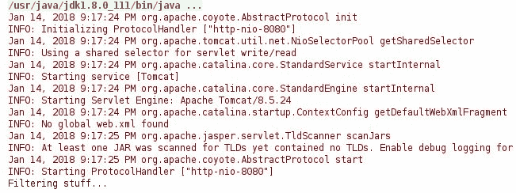

# 以编程方式创建、配置和运行 Tomcat 服务器

> 原文：<https://web.archive.org/web/20220930061024/https://www.baeldung.com/tomcat-programmatic-setup>

## 1。概述

在这篇简短的文章中，我们将通过编程来创建、配置和运行一个 Tomcat 服务器。

## 2。设置

在我们开始之前，我们需要通过将下面的依赖项添加到我们的`pom.xml`来设置我们的 Maven 项目:

```java
<dependencies>
    <dependency>
        <groupId>org.apache.tomcat</groupId>
        <artifactId>tomcat-catalina</artifactId>
        <version>${tomcat.version}</version>
    </dependency>
    <dependency>
        <groupId>org.apache.httpcomponents</groupId>
        <artifactId>httpclient</artifactId>
        <version>${apache.httpclient}</version>
    </dependency>
    <dependency>
        <groupId>junit</groupId>
        <artifactId>junit</artifactId>
        <version>${junit.version}</version>
        <scope>test</scope>
    </dependency>
</dependencies> 
```

这里有一个到 Maven Central 的[链接，其中包含项目中使用的依赖项的最新版本。](https://web.archive.org/web/20221129020548/https://search.maven.org/classic/#search%7Cga%7C1%7C(g%3A%22org.apache.tomcat%22%20AND%20a%3A%22tomcat-catalina%22)%20OR%20(g%3A%22org.apache.httpcomponents%22%20AND%20a%3A%22httpclient%22)%20OR%20(g%3A%22junit%22%20AND%20a%3A%22junit%22))

## 3。初始化和配置 Tomcat

让我们首先讨论一下 Tomcat 服务器的初始化和配置所需的步骤。

### 3.1。创建 Tomcat

我们可以通过简单地执行以下操作来创建实例:

```java
Tomcat tomcat = new Tomcat(); 
```

现在我们有了服务器，让我们来配置它。

### 3.2。配置 Tomcat

我们将关注如何启动并运行服务器，添加 servlet 和过滤器。

首先，我们需要配置一个端口、主机名和一个`appBase`(通常是 web 应用程序)。出于我们的目的，我们将使用当前目录:

```java
tomcat.setPort(8080);
tomcat.setHostname("localhost");
String appBase = ".";
tomcat.getHost().setAppBase(appBase); 
```

接下来，我们需要设置一个`docBase`(这个 web 应用程序的上下文根目录):

```java
File docBase = new File(System.getProperty("java.io.tmpdir"));
Context context = tomcat.addContext("", docBase.getAbsolutePath()); 
```

至此，我们有了一个几乎正常工作的 Tomcat。

接下来，我们将添加一个 servlet 和一个过滤器，并启动服务器，看看它是否在工作。

### 3.3。向 Tomcat 上下文添加 Servlet

接下来，我们将向`HttpServletResponse.` 添加一个简单的文本，这是当我们访问这个 servlet 的 URL 映射时将要显示的文本。

让我们首先定义我们的 servlet:

```java
public class MyServlet extends HttpServlet {

    @Override
    protected void doGet(
      HttpServletRequest req, 
      HttpServletResponse resp) throws IOException {

        resp.setStatus(HttpServletResponse.SC_OK);
        resp.getWriter().write("test");
        resp.getWriter().flush();
        resp.getWriter().close();
    }
} 
```

现在我们将这个 servlet 添加到 Tomcat 服务器:

```java
Class servletClass = MyServlet.class;
Tomcat.addServlet(
  context, servletClass.getSimpleName(), servletClass.getName());
context.addServletMappingDecoded(
  "/my-servlet/*", servletClass.getSimpleName()); 
```

### 3.4。向 Tomcat 上下文添加过滤器

接下来，我们定义一个过滤器并将其添加到 Tomcat 中:

```java
public class MyFilter implements Filter {

    @Override
    public void init(FilterConfig filterConfig) {
        // ...
    }

    @Override
    public void doFilter(
      ServletRequest request, 
      ServletResponse response, 
      FilterChain chain) 
      throws IOException, ServletException {

        HttpServletResponse httpResponse = (HttpServletResponse) response;
        httpResponse.addHeader("myHeader", "myHeaderValue");
        chain.doFilter(request, httpResponse);
    }

    @Override
    public void destroy() {
        // ...
    }
} 
```

将过滤器添加到上下文需要更多的工作:

```java
Class filterClass = MyFilter.class;
FilterDef myFilterDef = new FilterDef();
myFilterDef.setFilterClass(filterClass.getName());
myFilterDef.setFilterName(filterClass.getSimpleName());
context.addFilterDef(myFilterDef);

FilterMap myFilterMap = new FilterMap();
myFilterMap.setFilterName(filterClass.getSimpleName());
myFilterMap.addURLPattern("/my-servlet/*");
context.addFilterMap(myFilterMap); 
```

此时，我们应该向 Tomcat 添加了一个 servlet 和一个过滤器。

剩下要做的就是启动它，获得“测试”页面，并检查日志，看看过滤器是否工作。

## 4。启动 Tomcat

这是一个非常简单的操作，之后，我们应该会看到 Tomcat 运行:

```java
tomcat.start();
tomcat.getServer().await(); 
```

启动后，我们可以转到 http://localhost:8080/my-servlet 并查看测试页面:

[](/web/20221129020548/https://www.baeldung.com/wp-content/uploads/2018/01/my-servlet.png)

如果我们查看日志，我们会看到类似这样的内容:

[](/web/20221129020548/https://www.baeldung.com/wp-content/uploads/2018/01/tomcat-logs.jpg)

这些日志显示 Tomcat 开始监听端口 8080，并且我们的过滤器工作正常。

## 5。结论

在本教程中，我们经历了 Tomcat 服务器的基本编程设置。

我们研究了如何创建、配置和运行服务器，还研究了如何以编程方式向 Tomcat 上下文添加 Servlet 和过滤器。

和往常一样，完整的实现可以在 Github 上找到[。](https://web.archive.org/web/20221129020548/https://github.com/eugenp/tutorials/tree/master/libraries-server)